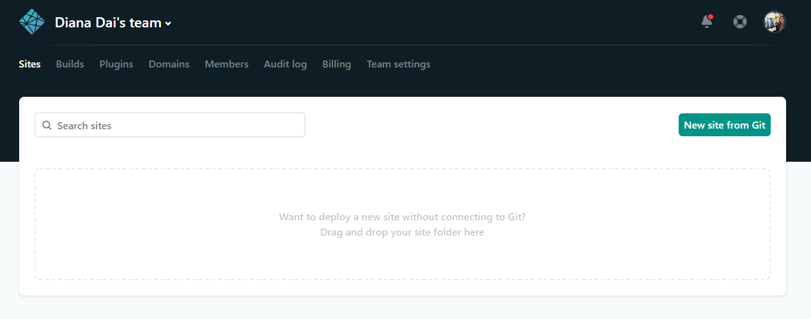
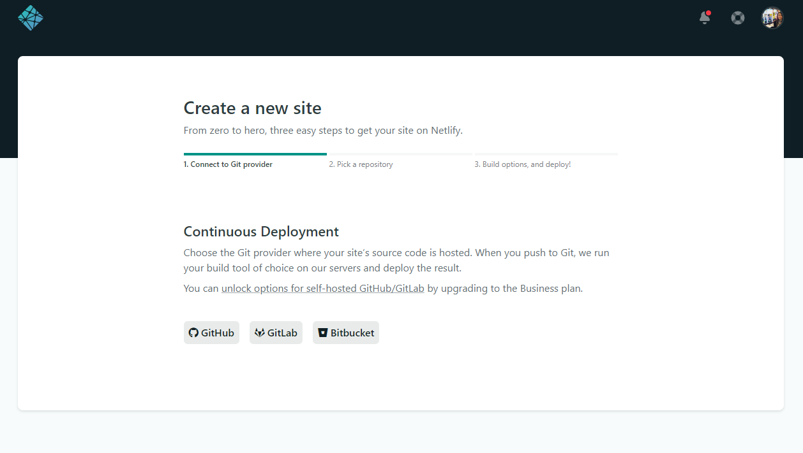
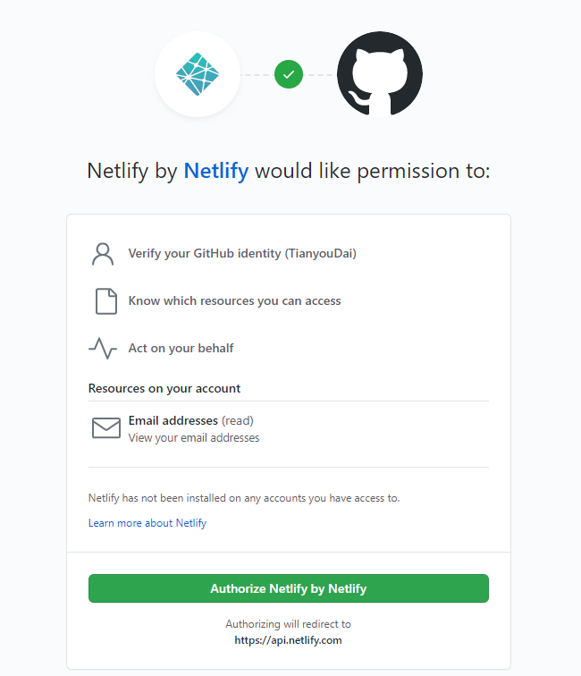
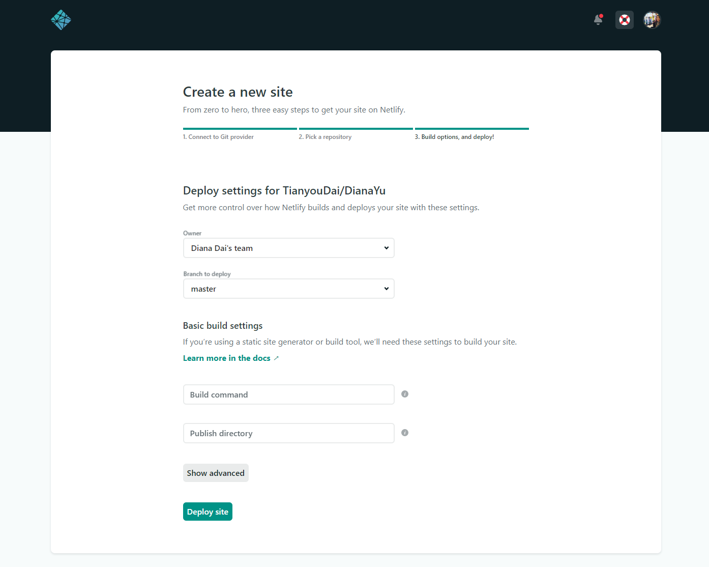

# DeployingOnNetlify

This tutorial shows you how to launch your site on Netlify as a GitHub login user.

## Step 1: Login Netlify with GitHub Authorization

## Step 2: Add New Site
It is very straightforward to create new site on Netlify. Click New site from Git button shown below. 

## Step 3: Link to Your GitHub

## Step 4: Authorize Netlify

## Step 5: Select Your Repo

## Step 6: Configure Your Settings
Here you can configure your options. Make sure your publish directory is where your public site files are placed after building the site, and your build command is whatever you run to build the site. Then click the Deploy site button to continue. I left them blank because my files are on GitHub and they are static

